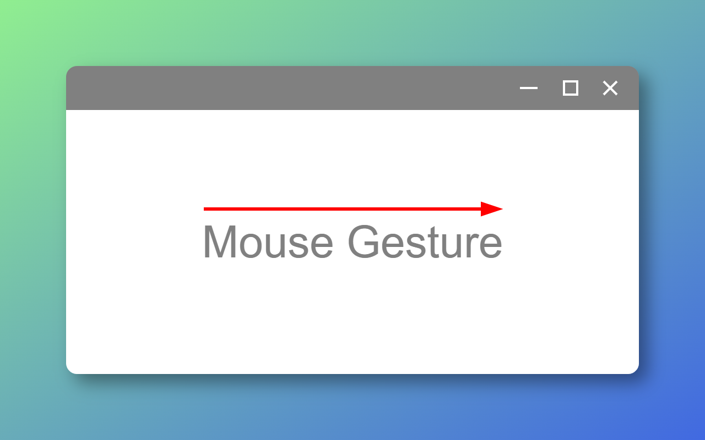
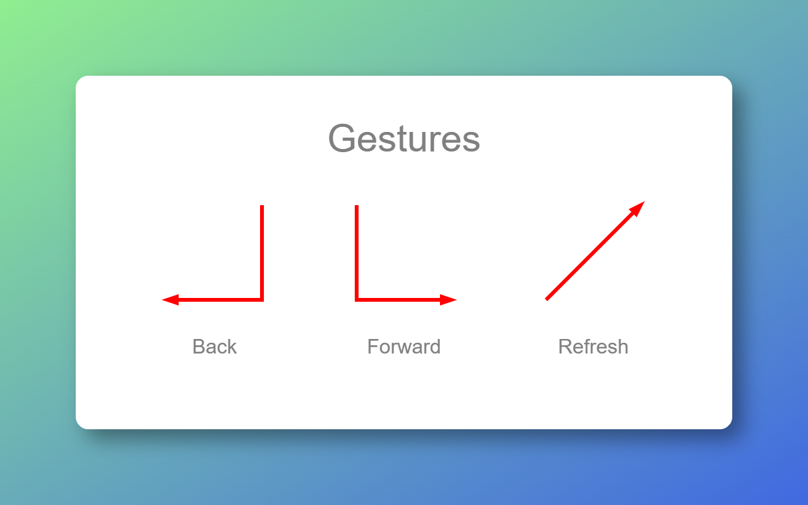

# Mouse Gesture

**Mouse Gesture** is a simple and efficient Chrome extension that lets you perform browser actions with intuitive mouse gestures.

## Preview (conceptual)

## Features

- Navigate **Back**, **Forward**, or **Refresh** using mouse gestures  
- Visual feedback with clean gesture trails  
- No setup needed — works out of the box  
- Lightweight and privacy-respecting (no external network access)  
- Fully open source at: https://github.com/jmnote/mouse-gesture

## Usage

1. Hold the **right mouse button** and draw one of the predefined gesture paths:
   - ↓← **Back**
   - ↓→ **Forward**
   - ↗ **Refresh**

2. Release the button to trigger the corresponding action.

## License

This project is licensed under the [Apache License 2.0](LICENSE).
